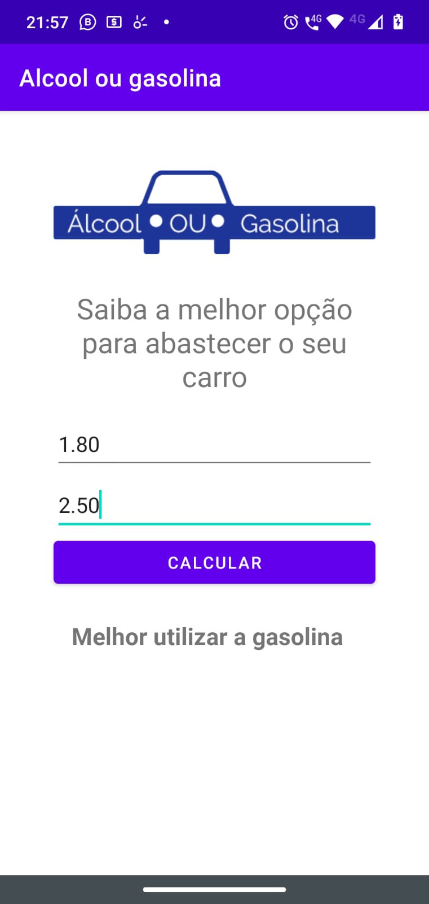

# Álcool ou Gasolina :fuelpump:

**Projeto da Udemy**

Já quis saber se é melhor abastecer o seu veículo com álcool ou gasolina? Bem, agora você pode saber. O intuito deste projeto é permitir que o usuário consiga saber
qual o melhor combustível para o seu veículo.

Basta inserir o valor do álcool e o valor do combustível que o aplicativo irá dizer para você.

## Interface do Aplicativo

